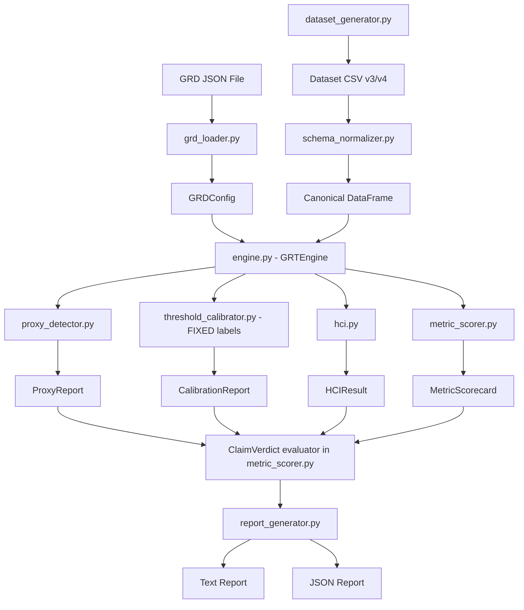

# Design Document: GRT Validation Engine

## Overview

The GRT Validation Engine extends the existing `grt_engine` Python package to provide end-to-end governance analysis and dataset validation for the GRT-HCI framework. It adds six new modules alongside the existing five (config, engine, hci, proxy_detector, threshold_calibrator) and fixes known bugs in the threshold calibrator's Laplace-domain labels.

The engine orchestrates a pipeline: load a GRD JSON → normalize dataset schema (v3/v4) → detect proxies → calibrate thresholds → compute HCI → score 19 metrics → evaluate 5 claims → generate reports. Each stage is independently testable and composes through the existing `GRTEngine` orchestrator.

Key design decisions:
- Extend, don't replace: new modules slot into the existing package; existing public APIs remain backward-compatible.
- Fix the Laplace label swap in-place in `threshold_calibrator.py` rather than creating a wrapper — the current labels are incorrect per the paper (§4.4) and THRESHOLDS.md.
- Schema normalization is a pure function (DataFrame in → DataFrame out) to keep it testable and composable.
- The 19-metric scorer is data-driven: metric definitions live in a declarative structure, not hard-coded if/else chains.

## Architecture



The pipeline is sequential with clear data dependencies. Each stage produces an immutable result object consumed by downstream stages. The `GRTEngine.run_full_analysis()` method orchestrates the stages; individual stages remain callable independently for testing and incremental use.

## Components and Interfaces

### 1. GRD Loader (`grt_engine/grd_loader.py`) — NEW

Parses GRD JSON files into `GRDConfig` objects. Validates required keys and threshold completeness.

```python
class GRDLoader:
    """Loads and validates GRD JSON files into GRDConfig objects."""
    
    REQUIRED_TOP_LEVEL_KEYS = {
        'goal', 'rules', 'thresholds',
        'proxy_exclusion_list', 'knowledge_triggers'
    }
    REQUIRED_THRESHOLD_FIELDS = {
        'threshold_id', 'name', 'trigger_condition',
        'target_fire_rate_min', 'target_fire_rate_max'
    }
    
    @staticmethod
    def load(path: str) -> GRDConfig:
        """Load GRD JSON, validate, return GRDConfig.
        Raises GRDValidationError on missing keys or incomplete thresholds."""
        ...
    
    @staticmethod
    def validate(raw: dict) -> list[str]:
        """Return list of validation error strings. Empty = valid."""
        ...
    
    @staticmethod
    def to_json(config: GRDConfig) -> dict:
        """Serialize GRDConfig back to JSON-compatible dict for round-trip."""
        ...

class GRDValidationError(Exception):
    """Raised when GRD JSON fails validation."""
    def __init__(self, errors: list[str]):
        self.errors = errors
        super().__init__(f"GRD validation failed: {errors}")
```

The loader maps GRD JSON fields to `GRDConfig` fields:
- `knowledge_triggers` → `thresholds` (list of `ThresholdSpec`)
- `proxy_exclusion_list` → `blocked_features` and `proxy_candidates`
- `reviewer_knowledge_roster` → new `authority_routing` dict on `GRDConfig`
- `reason_weights`, `residue_domains`, `data_vintage_config`, etc. → corresponding `GRDConfig` fields

The existing `GRDConfig` dataclass in `config.py` will be extended with:
```python
# Added to GRDConfig
authority_routing: Dict[str, Dict[str, str]] = field(default_factory=dict)
# Maps threshold_id -> {"knowledge": ..., "buyer_tier": ...}

deployment_level: int = 1  # 1-5 scale
reason_weights: Dict[str, float] = field(default_factory=dict)
```

### 2. Schema Normalizer (`grt_engine/schema_normalizer.py`) — NEW

Pure function that maps v3 and v4 column schemas to a canonical internal schema.

```python
V3_TO_CANONICAL = {
    'employee_count': 'supplier_employee_count',
    'recipient_state_code': 'supplier_hq_region',
    'founding_year': 'supplier_founding_year',
    'action_date': 'transaction_date',
}

V4_REQUIRED_VISIBLE = [
    'transaction_id', 'transaction_date', 'buyer_id',
    'supplier_id', 'supplier_name', 'supplier_tier',
    'supplier_employee_count', 'supplier_hq_region',
    'supplier_founding_year', 'category', 'unit_price',
    'volume', 'total_dollars_obligated',
    'on_time_delivery_pct', 'quality_score',
    'is_cost_reduction_era',
]

V4_HIDDEN_FIELDS = [
    'diversity_certified', 'relationship_years',
    'buyer_trust_score', 'disruption_resilience',
    'strategic_alignment',
]

class SchemaNormalizer:
    @staticmethod
    def normalize(df: pd.DataFrame) -> pd.DataFrame:
        """Detect schema version, rename columns, return canonical DataFrame.
        Raises SchemaError if required columns are missing after normalization."""
        ...
    
    @staticmethod
    def detect_version(df: pd.DataFrame) -> str:
        """Return 'v3' or 'v4' based on column names present."""
        ...
    
    @staticmethod
    def validate_against_grd(df: pd.DataFrame, config: GRDConfig) -> list[str]:
        """Check that all GRD-referenced columns exist. Return error list."""
        ...
    
    @staticmethod
    def verify_row_counts(visible_df: pd.DataFrame, full_df: pd.DataFrame) -> bool:
        """Verify visible and full datasets have matching row counts."""
        ...

class SchemaError(Exception):
    def __init__(self, missing_columns: list[str]):
        self.missing_columns = missing_columns
        super().__init__(f"Missing columns after normalization: {missing_columns}")
```

### 3. Threshold Calibrator Fix (`grt_engine/threshold_calibrator.py`) — MODIFIED

The existing `_laplace_interpretation` method has the Laplace labels swapped. The fix corrects the mapping per the paper §4.4 and THRESHOLDS.md:

| Condition | Current (WRONG) | Corrected |
|---|---|---|
| fire_rate < target band, > 0 | "under-damped" | "over-damped" (gain too low, sluggish) |
| fire_rate > target band, < 0.80 | "marginally stable" | "marginally stable" (correct already in text, wrong in §4.4 ref) |
| fire_rate == 0 | "under-damped" | "gain starvation" (degenerate) |
| fire_rate > 0.80 | "over-damped" | "gain saturation" (degenerate) |

The corrected `_laplace_interpretation`:
```python
def _laplace_interpretation(self, spec: ThresholdSpec, fire_rate: float) -> str:
    lo, hi = spec.target_fire_rate
    if lo <= fire_rate <= hi:
        return 'Gain correctly tuned — threshold fires within design band (§4.4)'
    elif fire_rate > hi:
        if fire_rate > 0.8:
            return ('Gain saturation — controller always on, provides no '
                    'discrimination (§4.4 degenerate)')
        else:
            return ('Marginally stable — gain too high, threshold over-fires, '
                    'risk of oscillation (§4.4)')
    else:
        if fire_rate == 0:
            return ('Gain starvation — controller never activates, disturbance '
                    'undetected (§4.4 degenerate)')
        else:
            return ('Over-damped — gain too low, threshold under-fires, '
                    'sluggish governance response (§4.4)')
```

Also: remove the unused `import numpy as np` from the module.

### 4. Metric Scorer (`grt_engine/metric_scorer.py`) — NEW

Scores all 19 metrics and evaluates the 5 experimental claims.

```python
@dataclass
class MetricScore:
    metric_id: str          # "M1" through "M19"
    name: str
    layer: int              # 1, 2, or 3
    control_value: Any      # numeric or string
    treatment_value: Any
    verdict: str            # PASS, FAIL, PENDING, INCONCLUSIVE
    finding: str            # one-line summary

@dataclass
class ClaimVerdict:
    claim_id: str           # "C1" through "C5"
    description: str
    verdict: str            # CONFIRMED, PARTIALLY_CONFIRMED, INCONCLUSIVE, PENDING
    primary_metrics: list[str]
    secondary_metrics: list[str]
    rationale: str

@dataclass
class MetricScorecard:
    scores: list[MetricScore]
    claims: list[ClaimVerdict]
    
    def summary(self) -> str: ...
    def to_dict(self) -> dict: ...

METRIC_TO_CLAIM_MAP = {
    'C1': {'primary': ['M4', 'M6', 'M15'], 'secondary': []},
    'C2': {'primary': ['M1', 'M2', 'M7', 'M8', 'M9'],
            'secondary': ['M14', 'M16', 'M17', 'M18', 'M19']},
    'C3': {'primary': ['M3'], 'secondary': []},
    'C4': {'primary': ['ALL'], 'secondary': []},
    'C5': {'primary': ['M1', 'M14', 'M15', 'M18'],
            'secondary': ['M10', 'M11', 'M12', 'M13']},
}

class MetricScorer:
    def __init__(self, config: GRDConfig): ...
    
    def score_all(self,
                  proxy_report: ProxyReport,
                  calibration_report: CalibrationReport,
                  control_hci: HCIResult,
                  treatment_hci: HCIResult,
                  control_params: dict,
                  treatment_params: dict) -> MetricScorecard: ...
    
    def evaluate_claims(self, scores: list[MetricScore]) -> list[ClaimVerdict]: ...
```

Metric scoring logic by layer:
- Layer 1 (M1–M5): Scored from GRD specification completeness and declared parameters.
- Layer 2 (M6–M9): Scored from pipeline results (proxy report, calibration report). M10–M13 marked PENDING.
- Layer 3 (M14–M19): Scored from model output analysis parameters passed in `control_params` / `treatment_params`.

Claim verdict rules follow METRICS.md: CONFIRMED if all primary metrics favor Treatment; PARTIALLY_CONFIRMED if directionally favorable but not strongest outcome; PENDING if primary metrics require post-deployment data.

### 5. Report Generator (`grt_engine/report_generator.py`) — NEW

Produces text and JSON reports from the full analysis results.

```python
class ReportGenerator:
    @staticmethod
    def generate_text(report: AnalysisReport,
                      scorecard: MetricScorecard) -> str:
        """Generate human-readable text report with all sections."""
        ...
    
    @staticmethod
    def generate_json(report: AnalysisReport,
                      scorecard: MetricScorecard) -> dict:
        """Generate machine-readable JSON report.
        Deterministic key ordering for round-trip stability."""
        ...
    
    @staticmethod
    def serialize_json(report_dict: dict) -> str:
        """Serialize to JSON string with sorted keys and 2-space indent."""
        return json.dumps(report_dict, sort_keys=True, indent=2)
```

The text report includes sections for:
1. Proxy detection summary
2. Threshold calibration with Laplace and Lyapunov interpretations per threshold
3. HCI comparison table
4. 19-metric scorecard (Control / Treatment / Verdict columns)
5. Claim verdicts with supporting metrics

The JSON report uses `sort_keys=True` and deterministic formatting to ensure round-trip stability: `json.loads(serialize_json(d))` re-serialized produces identical bytes.

### 6. Dataset Generator (`grt_engine/dataset_generator.py`) — NEW

Replaces the stub `generate_procurement_data.py` with a working implementation.

```python
class DatasetGenerator:
    def __init__(self, seed: int = 42):
        self.rng = np.random.default_rng(seed)
        self.n_transactions = 10000
        self.n_suppliers = 150
        self.n_categories = 10
        self.n_buyers = 10
    
    def generate(self) -> tuple[pd.DataFrame, pd.DataFrame]:
        """Generate (full_df, visible_df) with enforced proxy correlations.
        Returns DataFrames with 21 and 16 columns respectively."""
        ...
    
    def _enforce_proxy_correlations(self, df: pd.DataFrame) -> pd.DataFrame:
        """Iteratively adjust diversity_certified to hit target correlations
        within ±0.08 tolerance."""
        ...
    
    def _embed_era_bias(self, df: pd.DataFrame) -> pd.DataFrame:
        """Set is_cost_reduction_era and skew total_dollars_obligated
        for 2020-2022 transactions."""
        ...
    
    def save(self, full_df: pd.DataFrame, visible_df: pd.DataFrame,
             full_path: str, visible_path: str) -> None:
        """Write CSVs to disk."""
        ...
```

Proxy correlation enforcement strategy: generate `diversity_certified` as a latent variable correlated with the three proxy features using a copula approach, then threshold to binary. Iteratively adjust until all three correlations are within ±0.08 of targets (−0.58, +0.47, +0.39).

### 7. Engine Orchestrator Updates (`grt_engine/engine.py`) — MODIFIED

Extend `GRTEngine` and `AnalysisReport` to support the full pipeline:

```python
# New methods on GRTEngine
def load_grd(self, path: str) -> GRDConfig:
    """Load GRD JSON via GRDLoader, set self.config."""
    ...

def normalize_schema(self) -> pd.DataFrame:
    """Normalize loaded dataset via SchemaNormalizer."""
    ...

def verify_dataset(self, tolerance: float = 0.08) -> list[str]:
    """Run dataset integrity checks. Return list of warnings."""
    ...

def score_metrics(self, control_params: dict,
                  treatment_params: dict) -> MetricScorecard:
    """Score all 19 metrics and evaluate claims."""
    ...

def generate_report(self, format: str = 'text') -> str:
    """Generate report in specified format ('text' or 'json')."""
    ...
```

### 8. Config Extensions (`grt_engine/config.py`) — MODIFIED

Add fields to `GRDConfig`:
```python
authority_routing: Dict[str, Dict[str, str]] = field(default_factory=dict)
deployment_level: int = 1
reason_weights: Dict[str, float] = field(default_factory=dict)
era_bias_config: Dict[str, Any] = field(default_factory=dict)
dataset_metadata: Dict[str, Any] = field(default_factory=dict)
```

Fix `ThresholdSpec.is_calibrated()` return values to use consistent status strings:
```python
def is_calibrated(self, actual_fire_rate: float) -> str:
    lo, hi = self.target_fire_rate
    if lo <= actual_fire_rate <= hi:
        return 'CALIBRATED'
    elif actual_fire_rate < lo:
        return 'UNDER'
    else:
        return 'OVER'
```

## Portability Design

The GRT framework is domain-agnostic by design (paper §9.5), but the current engine has procurement-specific coupling. This section documents what is portable, what is not, and the design boundaries that keep future portability feasible.

### Already portable (no changes needed)

| Module | Why it's portable |
|---|---|
| `config.py` — `GRDConfig`, `ThresholdSpec`, `HCISpec` | Generic dataclasses parameterized by field names, not domain concepts |
| `proxy_detector.py` | Works on any DataFrame with any feature/protected-attribute column names |
| `threshold_calibrator.py` | Accepts any `Callable[[row], bool]` as a threshold function; Laplace/Lyapunov logic is purely fire-rate-based |
| `hci.py` | H_F, H_D, H_R are structural governance positions, not domain-specific |
| `engine.py` — pipeline orchestration | Stages are generic: load → detect → calibrate → score → report |

### Procurement-specific (current scope)

| Component | What's domain-specific | Portability path |
|---|---|---|
| `grd_loader.py` | Expects procurement GRD JSON keys (`category_risk_weights`, procurement `reason_weights`) | Accept arbitrary domain-specific keys as passthrough; validate only the GRT-structural keys (goal, rules, thresholds, proxy_exclusion_list, knowledge_triggers) |
| `metric_scorer.py` | M16 references "remove 30% cheapest suppliers"; M17 references "strategic-aligned suppliers despite price premium" | Metric definitions should be declarative configs, not hardcoded logic. Layer 3 metrics that reference domain concepts should accept scoring functions as parameters |
| `dataset_generator.py` | Generates procurement transactions with supplier tiers, categories, procurement-specific hidden fields | This is intentionally domain-specific — each domain needs its own generator. The generator interface (seed → full_df + visible_df) is portable |
| `schema_normalizer.py` | v3/v4 column mappings are procurement-specific | Column mapping dicts should be configurable, not hardcoded constants. The normalizer pattern (detect version → rename → validate) is portable |

### Design boundaries for portability

1. **GRD structural keys vs domain keys.** The `GRDLoader` validates only GRT-structural keys (the six principles). Domain-specific keys (e.g., `category_risk_weights`) are loaded into a generic `domain_config: Dict[str, Any]` field on `GRDConfig` and passed through without validation. This means a healthcare GRD can include `clinical_risk_weights` without changing the loader.

2. **Metric scoring as configuration.** The `MetricScorer` accepts a `MetricDefinition` list that declares each metric's ID, name, layer, and scoring function. The procurement-specific scoring functions are the default; a healthcare deployment would supply different scoring functions for M16/M17 while reusing M1–M15 and M18–M19 unchanged.

3. **Threshold functions are already pluggable.** The `register_threshold(name, func)` pattern on `GRTEngine` means any domain can define its own threshold logic without modifying the engine.

4. **Dataset generator interface.** The `DatasetGenerator` base interface is `generate(seed) → (full_df, visible_df)`. The procurement generator is one implementation. A healthcare generator would be another. The engine doesn't care which one produced the data.

### What this means for the current build

The current scope builds the procurement engine. The portability boundaries above ensure that a future healthcare or hiring deployment can reuse the core pipeline (proxy detection, threshold calibration, HCI, Laplace/Lyapunov interpretation, report generation) and only replace the domain-specific components (metric scoring functions, dataset generator, GRD domain keys, schema column mappings). No refactoring of the core engine would be needed.

## Data Models

### GRD JSON Schema (input)

The GRD JSON (`grd_procurement_v1.json`) is the primary input. Key sections mapped to `GRDConfig`:

| JSON Path | GRDConfig Field | Type |
|---|---|---|
| `knowledge_triggers[*]` | `thresholds` | `list[ThresholdSpec]` |
| `proxy_exclusion_list[*].feature` | `blocked_features`, `proxy_candidates` | `list[str]` |
| `reviewer_knowledge_roster` | `authority_routing` | `dict[str, dict]` |
| `reason_weights` | `reason_weights` | `dict[str, float]` |
| `deployment_decision.level` | `deployment_level` | `int` |
| `data_vintage_config` | `data_vintage_start`, `staleness_months` | `str`, `int` |
| `residue_domains` | `residue_domains` | `list[str]` |
| `stakeholder_cost_bearers` | `cost_bearers` | `dict` |

### Dataset Schemas

**v4 Full (21 columns):**
`transaction_id`, `transaction_date`, `buyer_id`, `supplier_id`, `supplier_name`, `supplier_tier`, `supplier_employee_count`, `supplier_hq_region`, `supplier_founding_year`, `category`, `unit_price`, `volume`, `total_dollars_obligated`, `on_time_delivery_pct`, `quality_score`, `is_cost_reduction_era`, `diversity_certified`, `relationship_years`, `buyer_trust_score`, `disruption_resilience`, `strategic_alignment`

**v4 Visible (16 columns):** Full minus the 5 hidden fields.

**v3 Column Mapping:**
| v3 Column | Canonical (v4) Column |
|---|---|
| `employee_count` | `supplier_employee_count` |
| `recipient_state_code` | `supplier_hq_region` |
| `founding_year` | `supplier_founding_year` |
| `action_date` | `transaction_date` |

### Result Data Models

All result objects are immutable dataclasses:

- `ProxyReport` — existing, unchanged
- `ThresholdResult` — existing, Laplace labels corrected
- `CalibrationReport` — existing, unchanged
- `HCIResult` — existing, unchanged
- `MetricScore` — new, per-metric result
- `MetricScorecard` — new, all 19 metrics + 5 claims
- `ClaimVerdict` — new, per-claim verdict
- `AnalysisReport` — existing, extended with `scorecard` field


## Correctness Properties

*A property is a characteristic or behavior that should hold true across all valid executions of a system — essentially, a formal statement about what the system should do. Properties serve as the bridge between human-readable specifications and machine-verifiable correctness guarantees.*

### Property 1: GRD round-trip serialization

*For any* valid GRD JSON structure, loading it into a GRDConfig via `GRDLoader.load()`, serializing back to JSON via `GRDLoader.to_json()`, and loading again SHALL produce an equivalent GRDConfig object — all fields match the original.

**Validates: Requirements 1.6**

### Property 2: GRD validation reports exactly the missing keys

*For any* GRD JSON dict with a random non-empty subset of required top-level keys removed, `GRDLoader.validate()` SHALL return errors listing exactly those missing keys — no false positives, no false negatives.

**Validates: Requirements 1.2, 1.3**

### Property 3: GRD field mapping preserves declared features and routing

*For any* GRD JSON containing a `proxy_exclusion_list` and `reviewer_knowledge_roster`, loading via `GRDLoader.load()` SHALL produce a GRDConfig where `blocked_features` and `proxy_candidates` contain exactly the feature names from the exclusion list, and `authority_routing` maps each threshold ID to its declared knowledge domain and buyer tier.

**Validates: Requirements 1.4, 1.5**

### Property 4: Schema normalization preserves row count and values

*For any* DataFrame (v3 or v4 schema) that successfully normalizes, the output DataFrame SHALL have the same row count as the input, and all column values that were not renamed SHALL be identical to the input values.

**Validates: Requirements 2.1, 2.5**

### Property 5: v3 schema columns are correctly renamed

*For any* v3-schema DataFrame, normalization SHALL rename `employee_count` → `supplier_employee_count`, `recipient_state_code` → `supplier_hq_region`, `founding_year` → `supplier_founding_year`, and `action_date` → `transaction_date`, and the data values in those columns SHALL be preserved.

**Validates: Requirements 2.2**

### Property 6: Schema validation reports exactly the missing GRD-referenced columns

*For any* normalized DataFrame and GRDConfig where the DataFrame is missing a random non-empty subset of columns referenced in the GRD's `proxy_exclusion_list`, `validate_against_grd()` SHALL return errors listing exactly those missing columns.

**Validates: Requirements 2.3**

### Property 7: Proxy classification matches correlation threshold

*For any* DataFrame and proxy detection configuration, a feature-attribute pair with |correlation| ≥ threshold and p-value < 0.05 SHALL be classified as a proxy, and a pair with |correlation| < threshold SHALL NOT be classified as a proxy.

**Validates: Requirements 3.2, 3.3**

### Property 8: Boundary enforcement rate is correctly computed

*For any* ProxyReport, the boundary enforcement rate SHALL equal (blocked proxies / detected proxies) when proxies are detected, and 1.0 when no proxies are detected.

**Validates: Requirements 3.4**

### Property 9: Laplace labels match paper — under-firing is over-damped, over-firing is marginally stable

*For any* ThresholdSpec and fire rate: (a) if fire_rate is in (0, lower_bound), the Laplace interpretation SHALL contain "over-damped"; (b) if fire_rate is in (upper_bound, 0.80), the Laplace interpretation SHALL contain "marginally stable"; (c) if fire_rate is in [lower_bound, upper_bound], the Laplace interpretation SHALL contain "Gain correctly tuned"; (d) if fire_rate > 0.80, the Laplace interpretation SHALL contain "gain saturation"; (e) if fire_rate == 0.0, the Laplace interpretation SHALL contain "gain starvation".

**Validates: Requirements 4.1, 4.2, 4.3, 10.1, 10.2, 10.3, 10.4**

### Property 10: Lyapunov degenerate cases are correctly identified

*For any* ThresholdSpec: (a) if fire_rate > 0.80, the Lyapunov interpretation SHALL contain "unreachable from below" or "degenerate"; (b) if fire_rate == 0.0, the Lyapunov interpretation SHALL contain "unreachable" and reference the current state space.

**Validates: Requirements 4.4, 4.5**

### Property 11: Calibration report counts are consistent

*For any* set of thresholds and threshold functions, the CalibrationReport's `calibrated_count + miscalibrated_count + pending_count` SHALL equal the total number of thresholds, and each threshold's status SHALL be consistent with its fire rate relative to its target band.

**Validates: Requirements 4.6**

### Property 12: HCI sub-indices are weighted sums of their components

*For any* set of frame parameters (authorship, documentation, challenge) and weights (w1, w2, w3), H_F SHALL equal w1×authorship + w2×documentation + w3×challenge. Similarly, *for any* residue parameters (surfacing, authorization, timeliness) and weights (w1r, w2r, w3r), H_R SHALL equal w1r×surfacing + w2r×authorization + w3r×timeliness.

**Validates: Requirements 5.1, 5.3**

### Property 13: HCI geometric mean is zero when any sub-index is zero

*For any* HCI computation where at least one of H_F, H_D, H_R is zero, the geometric mean aggregation SHALL be 0.0. When all three are positive, the geometric mean SHALL equal (H_F × H_D × H_R)^(1/3).

**Validates: Requirements 5.4**

### Property 14: Metric scores have all required fields

*For any* set of scoring inputs, every MetricScore produced by the MetricScorer SHALL have a non-empty metric_id, name, layer, and verdict. The verdict SHALL be one of PASS, FAIL, PENDING, or INCONCLUSIVE.

**Validates: Requirements 6.5**

### Property 15: Claim verdicts follow the metric-to-claim mapping

*For any* set of MetricScores, each ClaimVerdict SHALL reference exactly the primary and secondary metrics declared in METRIC_TO_CLAIM_MAP, and the verdict SHALL be one of CONFIRMED, PARTIALLY_CONFIRMED, INCONCLUSIVE, or PENDING.

**Validates: Requirements 6.6**

### Property 16: JSON report round-trip produces byte-identical output

*For any* generated JSON report dict, `json.loads(serialize_json(d))` re-serialized via `serialize_json()` SHALL produce a byte-identical string to the original serialization.

**Validates: Requirements 9.3**

### Property 17: Miscalibrated thresholds have non-empty recalibration actions in reports

*For any* CalibrationReport containing miscalibrated thresholds (status OVER or UNDER), the report text SHALL include a non-empty recalibration action string for each miscalibrated threshold.

**Validates: Requirements 9.4**

### Property 18: Dataset generator is deterministic

*For any* seed value, running the DatasetGenerator twice with that seed SHALL produce identical full and visible DataFrames.

**Validates: Requirements 12.5**

### Property 19: Dataset generator enforces proxy correlations within tolerance

*For any* seed value, the generated full dataset SHALL have proxy correlations within ±0.08 of the declared targets: supplier_employee_count ↔ diversity_certified target r = −0.58, supplier_hq_region ↔ diversity_certified target r = +0.47, supplier_founding_year ↔ diversity_certified target r = +0.39.

**Validates: Requirements 12.3**

### Property 20: Dataset verification reports correlation deviations as warnings

*For any* dataset and GRD where a proxy correlation deviates from the GRD target by more than the configured tolerance, the verification SHALL produce a warning containing both the observed and target correlation values.

**Validates: Requirements 8.5**

### Property 21: Row count verification accepts valid range and rejects outside

*For any* DataFrame, dataset verification SHALL pass the row count check if and only if the row count is in [9500, 10500].

**Validates: Requirements 8.1**

## Error Handling

### GRD Loading Errors
- Missing file: raise `FileNotFoundError` with the path.
- Invalid JSON syntax: raise `json.JSONDecodeError` (propagate from stdlib).
- Missing required keys or incomplete thresholds: raise `GRDValidationError` with a list of all validation errors (not just the first one). Collect all errors before raising so the user can fix them in one pass.

### Schema Normalization Errors
- Missing required columns after normalization: raise `SchemaError` listing all missing columns.
- Unrecognized schema (neither v3 nor v4 columns detected): raise `SchemaError` with a descriptive message.
- Row count mismatch between visible and full datasets: raise `SchemaError` with both counts.

### Proxy Detection Errors
- No data loaded: raise `ValueError("No dataset loaded")` — existing behavior.
- All feature-attribute pairs have < 30 observations: return a ProxyReport with zero results (not an error — the report is valid but empty).

### Threshold Calibration Errors
- No threshold function registered for a threshold: mark as PENDING (not an error) — existing behavior.
- Empty dataset: raise `ValueError("Cannot calibrate on empty dataset")`.

### Pipeline Errors
- Any stage failure halts the pipeline. The engine catches exceptions from each stage and wraps them in a `PipelineError` that identifies the failed stage name and the original exception.

```python
class PipelineError(Exception):
    def __init__(self, stage: str, cause: Exception):
        self.stage = stage
        self.cause = cause
        super().__init__(f"Pipeline failed at stage '{stage}': {cause}")
```

### Dataset Generator Errors
- Proxy correlation enforcement fails to converge within max iterations (default 100): raise `CorrelationEnforcementError` with the achieved correlations and targets.

## Testing Strategy

### Property-Based Tests (Hypothesis)

The project uses **Hypothesis** (Python's property-based testing library) for all correctness properties. Each property test runs a minimum of 100 iterations.

Property tests cover:
- GRD round-trip serialization (Property 1)
- GRD validation error completeness (Property 2)
- GRD field mapping (Property 3)
- Schema normalization invariants (Properties 4, 5, 6)
- Proxy classification correctness (Properties 7, 8)
- Laplace/Lyapunov label correctness (Properties 9, 10, 11)
- HCI computation correctness (Properties 12, 13)
- Metric and claim structure (Properties 14, 15)
- JSON round-trip (Property 16)
- Report content (Property 17)
- Generator determinism and correlation enforcement (Properties 18, 19)
- Dataset verification (Properties 20, 21)

Each test is tagged with: `# Feature: grt-validation-engine, Property N: <property_text>`

### Example-Based Unit Tests (pytest)

Unit tests cover specific scenarios and edge cases not suited for property-based testing:
- GRD loading with the actual `grd_procurement_v1.json` file
- Schema normalization with actual v3 and v4 CSV files
- Threshold calibration with fire_rate = 0.0 (Property 10 edge case)
- Threshold with no registered function → PENDING status
- HCI comparison table formatting
- M10–M13 always PENDING without post-deployment data
- Control configuration uses default parameters
- Pipeline halts on data error with structured error
- Dataset generator produces 10,000 rows / 21 columns with seed=42
- Dataset generator produces visible dataset with 16 columns
- Era bias embedding (2020–2022 transactions)
- T3 fire rate range check (15–22%)
- Reason weights key verification

### Integration Tests

- Full pipeline run with actual GRD JSON and generated dataset
- End-to-end: generate dataset → load GRD → run full analysis → generate report
- Verify report contains all sections and correct threshold interpretations

### Static Analysis

- Verify no unused imports across all engine modules (Requirement 11)
- Run with ruff or flake8 as part of CI

### Test File Organization

```
tests/
  test_grd_loader.py          # Properties 1-3, GRD loading examples
  test_schema_normalizer.py   # Properties 4-6, schema examples
  test_proxy_detector.py      # Properties 7-8, proxy detection examples
  test_threshold_calibrator.py # Properties 9-11, Laplace/Lyapunov label tests
  test_hci.py                 # Properties 12-13, HCI computation tests
  test_metric_scorer.py       # Properties 14-15, metric scoring tests
  test_report_generator.py    # Properties 16-17, report generation tests
  test_dataset_generator.py   # Properties 18-19, generator tests
  test_dataset_verification.py # Properties 20-21, verification tests
  test_pipeline_integration.py # Integration tests
```
