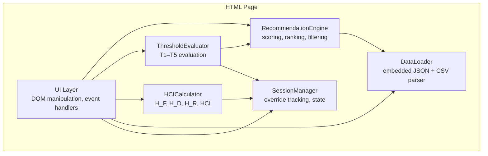
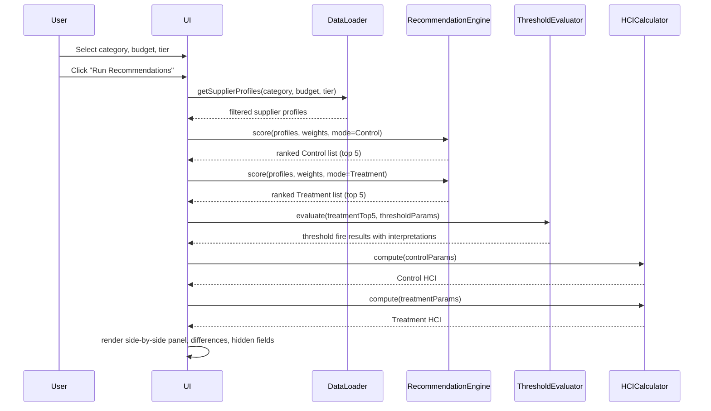

# Design Document: Live Recommendation Tester

## Overview

The Live Recommendation Tester is a self-contained, single-file HTML page that runs a dual recommendation engine in the browser. It lets a procurement user specify a category, budget range, and tier filter, then instantly see two ranked supplier lists side-by-side: Control (all 16 visible features including 3 proxy features) and Treatment (13 features with proxies excluded per GRD Rule R2). The page evaluates 5 governance thresholds with Laplace/Lyapunov interpretations, computes HCI for both configurations, supports buyer overrides that affect HCI, discloses hidden fields for Treatment recommendations, and highlights ranking differences between the two models.

All logic runs in client-side JavaScript. The page embeds a compact default dataset (150 supplier profiles aggregated from the 10,000-transaction CSV) and supports CSV upload for the full dataset. The visual style matches `grt_dashboard.html` (color palette `#1B3A5C` / `#2E6DA4` / `#1F7A4D` / `#C55A11`, card layout, compact typography).

### Key Design Decisions

1. **Supplier-profile aggregation over raw transactions.** The 10,000-row CSV is ~1.5 MB — too large to embed as JSON in an HTML file. Instead, we pre-aggregate to 150 supplier profiles (one per supplier, with per-category averages for numeric fields). The embedded JSON is ~30 KB. Users can upload the full CSV for transaction-level fidelity.
2. **Weighted-sum scoring.** Both Control and Treatment use a weighted sum of min-max normalized features. This mirrors the Python engine's approach and is simple enough to implement in ~50 lines of JS.
3. **Reason-weight boosts apply only to Treatment.** The GRD's non-goal guardrails (supplier diversity, resilience, strategic partnerships, innovation) apply score boosts to Treatment recommendations only, weighted by the reason weights from the GRD.
4. **Session-scoped override tracking.** Override events are tracked in a JS array for the session. T5 (Override Pattern Detection) evaluates against this array.
5. **All weights and thresholds are adjustable.** Sliders and numeric inputs let the user tune scoring weights, reason weights, and threshold values in real time, with a "Reset to GRD Defaults" button.

## Architecture

The page is organized as a single HTML file with embedded CSS and JavaScript. The JS is structured into logical modules (closures/objects within a single `<script>` block):



### Data Flow



## Components and Interfaces

### 1. DataLoader

Responsible for loading, parsing, and serving supplier data.

```typescript
interface SupplierProfile {
  supplier_id: string;
  supplier_name: string;
  supplier_tier: "LARGE" | "SMALL";
  supplier_employee_count: number;       // proxy
  supplier_hq_region: string;            // proxy
  supplier_founding_year: number;        // proxy
  category: string;
  avg_unit_price: number;
  avg_volume: number;
  avg_total_dollars_obligated: number;
  avg_on_time_delivery_pct: number;
  avg_quality_score: number;
  is_cost_reduction_era_pct: number;
  transaction_count: number;
  last_transaction_date: string;         // ISO date string
  // Hidden fields (from full dataset)
  diversity_certified?: boolean;
  avg_relationship_years?: number;
  avg_buyer_trust_score?: number;
  avg_disruption_resilience?: number;
  strategic_alignment?: boolean;
  // Aggregated spend share for T2
  category_spend_share?: number;
}

interface DataLoader {
  loadEmbedded(): SupplierProfile[];
  parseCSV(csvText: string): { profiles: SupplierProfile[]; errors: string[] };
  validateColumns(headers: string[]): string[];  // returns missing columns
  getProfiles(category: string, minBudget?: number, maxBudget?: number, tiers?: string[]): SupplierProfile[];
  getSummary(): { transactions: number; suppliers: number; categories: number };
}
```

**Aggregation logic:** When loading from the full 10,000-row CSV, the DataLoader groups rows by `(supplier_id, category)` and computes averages for numeric fields. For boolean hidden fields (`diversity_certified`, `strategic_alignment`), it takes the mode (most frequent value). `last_transaction_date` is the max date per supplier-category pair. `category_spend_share` is computed as the supplier's total spend in the category divided by total category spend.

**Embedded dataset:** A pre-computed JSON array of ~150 supplier profiles (one per supplier, with per-category sub-profiles flattened). This is generated offline from `procurement_data_full_v4.csv` and embedded in a `<script>` tag.

### 2. RecommendationEngine

Scores and ranks suppliers using weighted-sum scoring.

```typescript
interface ScoringWeights {
  on_time_delivery_pct: number;  // default 0.20
  quality_score: number;         // default 0.20
  unit_price: number;            // default 0.20 (inverted: lower is better)
  volume: number;                // default 0.20
  total_dollars_obligated: number; // default 0.20
}

interface ReasonWeights {
  Strategic: number;    // default 1.0
  Relationship: number; // default 0.9
  Resilience: number;   // default 0.7
  Price: number;        // default 0.4
}

interface ScoredSupplier {
  profile: SupplierProfile;
  rawScore: number;
  normalizedScore: number;
  reasonBoost: number;       // Treatment only
  finalScore: number;        // rawScore + reasonBoost (Treatment) or rawScore (Control)
  rank: number;
}

interface RecommendationEngine {
  scoreControl(profiles: SupplierProfile[], weights: ScoringWeights): ScoredSupplier[];
  scoreTreatment(profiles: SupplierProfile[], weights: ScoringWeights, reasonWeights: ReasonWeights): ScoredSupplier[];
  normalize(values: number[]): number[];  // min-max to [0, 1]
}
```

**Scoring algorithm:**

1. For each scoring feature, extract the raw values from all filtered profiles.
2. Min-max normalize each feature to [0, 1]. For `unit_price`, invert (1 - normalized) so lower price = higher score.
3. Compute weighted sum: `score = Σ(weight_i × normalized_i)`.
4. **Control:** Uses all 5 scoring features plus 3 proxy features (employee_count normalized, region encoded as ordinal 0–5 and normalized, founding_year normalized). Proxy features each get weight = average of the 5 main weights / 3.
5. **Treatment:** Uses only the 5 scoring features (proxy features excluded). Then applies reason-weight boosts from non-goal guardrails:
   - If supplier is diversity-certified (from hidden field) → boost by `non_goal_guardrails[supplier_diversity].score_boost × reasonWeights.Strategic`
   - If supplier has high disruption_resilience (>7.0) → boost by `non_goal_guardrails[supply_chain_resilience].score_boost × reasonWeights.Resilience`
   - If supplier has high relationship_years (>5.0) → boost by `non_goal_guardrails[strategic_partnerships].score_boost × reasonWeights.Relationship`
6. Rank by final score descending. Return top 5.

**Note on reason boosts:** The Treatment model applies reason boosts using hidden-field values. This models the GRD's non-goal guardrails — the Treatment system is designed to surface and weight factors that the Control model ignores. The boosts are small (0.08–0.15 × reason weight) and represent the governance system's mechanism for incorporating residue knowledge.

### 3. ThresholdEvaluator

Evaluates the 5 GRD thresholds against each Treatment top-5 supplier.

```typescript
interface ThresholdParams {
  t1_vintage_days: number;       // default 365
  t2_concentration_pct: number;  // default 0.40
  t3_high_value_dollars: number; // default 500000
  t4_confidence_floor: number;   // default 0.70
}

interface ThresholdFire {
  thresholdId: string;           // "T1"–"T5"
  name: string;
  fired: boolean;
  laplaceInterpretation: string;
  lyapunovInterpretation: string;
}

interface ThresholdEvaluator {
  evaluate(supplier: ScoredSupplier, params: ThresholdParams, overrideCounts: Map<string, number>, datasetMaxDate: string): ThresholdFire[];
}
```

**Threshold logic (mirrors Python `threshold_calibrator.py`):**

| Threshold | Condition | Laplace (if fired) | Lyapunov (if fired) |
|-----------|-----------|---------------------|---------------------|
| T1 Data Vintage | No transactions within `t1_vintage_days` of dataset max date | "Over-damped — stale data, sluggish response" | "Rare regime switching — boundary seldom crossed" |
| T2 Concentration | `category_spend_share > t2_concentration_pct` | "Marginally stable — gain too high" | "Frequent regime switching — check dwell-time" |
| T3 High-Value | `avg_total_dollars_obligated > t3_high_value_dollars` | "Marginally stable — gain too high" | "Frequent regime switching — check dwell-time" |
| T4 Confidence | `normalizedScore < t4_confidence_floor` | "Over-damped — low confidence, sluggish" | "Rare regime switching — boundary seldom crossed" |
| T5 Override Pattern | Supplier overridden ≥ 3 times in session | "Gain saturation — repeated override signal" | "System never leaves escalated regime" |

### 4. HCICalculator

Computes the Human Contribution Index using the geometric mean formula.

```typescript
interface HCIParams {
  frame_authorship: number;      // 0 or 1
  frame_documentation: number;   // 0–1
  frame_challenge: number;       // 0 or 1
  decision_position: string;     // maps to H_D value
  residue_surfacing: number;     // 0–1
  residue_authorization: number; // 0–1
  residue_timeliness: number;    // 0–1
}

interface HCIResult {
  h_f: number;
  h_d: number;
  h_r: number;
  hci: number;
}

interface HCICalculator {
  compute(params: HCIParams): HCIResult;
}
```

**Formula (mirrors Python `hci.py`):**
- `H_F = (authorship + documentation + challenge) / 3`
- `H_D = position_value` (from lookup: pre_execution=1.0, rt_active=0.75, rt_on_demand=0.50, post_execution_review=0.25, post_hoc_audit=0.10, none=0.00)
- `H_R = (surfacing + authorization + timeliness) / 3`
- `HCI = (H_F × H_D × H_R)^(1/3)` — if any sub-index is 0, HCI = 0.000

**Fixed parameters:**
- Control: `{authorship:0, documentation:0, challenge:0, position:"rt_on_demand", surfacing:0, authorization:0, timeliness:0}` → HCI = 0.000
- Treatment: `{authorship:1, documentation:0.80, challenge:1, position:"rt_active", surfacing:0.90, authorization:0.80, timeliness:0.70}` → HCI ≈ 0.824

### 5. SessionManager

Tracks override events and session state.

```typescript
interface OverrideEvent {
  timestamp: number;
  category: string;
  originalSupplier: string;
  selectedSupplier: string;
  reason?: string;
}

interface SessionManager {
  overrides: OverrideEvent[];
  recordOverride(event: OverrideEvent): void;
  recordConfirmation(supplier: string): void;
  getOverrideCount(supplierId: string): number;
  getTotalOverrides(): number;
  getCurrentAuthorizationBoost(): number;  // 0.05 per override, capped at 1.0
}
```

### 6. UI Layer

Renders all panels and handles user interaction. Key panels:

| Panel | Description |
|-------|-------------|
| Data Summary | Transaction/supplier/category counts after load |
| Procurement Need | Category dropdown, budget inputs, tier filter, Run button |
| Scoring Weights | 5 sliders (0.0–1.0) for feature weights |
| Reason Weights | 4 sliders for Strategic/Relationship/Resilience/Price |
| Threshold Tuning | 4 numeric inputs for T1–T4 values |
| Side-by-Side | Control (left) vs Treatment (right) top-5 lists |
| Difference Summary | Counts of moved-up, moved-down, added, removed suppliers |
| Threshold Fires | Per-supplier threshold status with Laplace/Lyapunov text |
| Hidden Fields | Treatment-only disclosure of 5 hidden columns |
| HCI Comparison | Control vs Treatment HCI with sub-indices |
| Override Panel | Select buttons per Treatment supplier, override history |
| GRD Summary | Collapsible panel showing rules, thresholds, proxy exclusions |
| Session Summary | Running override count, confirmation count |

## Data Models

### Embedded Dataset Schema

The embedded JSON is an array of supplier-category profiles:

```json
[
  {
    "supplier_id": "SUP_001",
    "supplier_name": "LargeSupplier_001",
    "supplier_tier": "LARGE",
    "supplier_employee_count": 15200,
    "supplier_hq_region": "Northeast",
    "supplier_founding_year": 1972,
    "category": "IT Hardware",
    "avg_unit_price": 245.50,
    "avg_volume": 1200,
    "avg_total_dollars_obligated": 612000,
    "avg_on_time_delivery_pct": 92.3,
    "avg_quality_score": 4.1,
    "is_cost_reduction_era_pct": 0.28,
    "transaction_count": 45,
    "last_transaction_date": "2026-02-15",
    "diversity_certified": false,
    "avg_relationship_years": 8.2,
    "avg_buyer_trust_score": 7.1,
    "avg_disruption_resilience": 6.8,
    "strategic_alignment": false,
    "category_spend_share": 0.12
  }
]
```

Each supplier may appear multiple times (once per category they operate in). The embedded dataset contains ~500–800 supplier-category profiles derived from 150 unique suppliers across 10 categories.

### GRD Configuration (Embedded)

A subset of `grd_procurement_v1.json` is embedded as a JS object:

```javascript
const GRD_CONFIG = {
  proxy_exclusions: [
    { feature: "supplier_employee_count", r_target: -0.503 },
    { feature: "supplier_hq_region", r_target: 0.405 },
    { feature: "supplier_founding_year", r_target: 0.382 }
  ],
  reason_weights: { Strategic: 1.0, Relationship: 0.9, Resilience: 0.7, Price: 0.4 },
  non_goal_guardrails: [
    { non_goal: "supplier_diversity", maps_to_reason: "Strategic", score_boost: 0.15 },
    { non_goal: "supply_chain_resilience", maps_to_reason: "Resilience", score_boost: 0.12 },
    { non_goal: "strategic_partnerships", maps_to_reason: "Relationship", score_boost: 0.10 },
    { non_goal: "innovation_partnerships", maps_to_reason: "Strategic", score_boost: 0.08 }
  ],
  thresholds: [
    { id: "T1", name: "Data Vintage Expiry", target_band: [0.10, 0.25], default_value: 365 },
    { id: "T2", name: "Concentration Risk", target_band: [0.10, 0.20], default_value: 0.40 },
    { id: "T3", name: "High-Value Authority", target_band: [0.15, 0.22], default_value: 500000 },
    { id: "T4", name: "Confidence Floor", target_band: [0.08, 0.15], default_value: 0.70 },
    { id: "T5", name: "Override Pattern Detection", target_band: [0.05, 0.10], default_value: 3 }
  ],
  residue_domains: [
    { domain: "organizational", weight: 0.4, maps_to: "Price" },
    { domain: "cultural", weight: 0.75, maps_to: "Relationship" },
    { domain: "interpersonal", weight: 0.9, maps_to: "Relationship" },
    { domain: "contextual", weight: 1.0, maps_to: "Strategic" },
    { domain: "experiential", weight: 0.7, maps_to: "Resilience" }
  ],
  deployment: { level: 2, label: "Automated with Thresholds" },
  category_risk_weights: {
    "Professional Services": 1.0, "IT Hardware": 0.8, "Raw Materials": 0.7,
    "Office Supplies": 0.4, "Facilities": 0.5, "Logistics": 0.7,
    "Marketing": 0.5, "HR Services": 0.8, "Legal Services": 1.0, "IT Software": 0.75
  }
};
```

### CSV Upload Schema

The CSV parser expects these 16 required visible columns:

| Column | Type | Description |
|--------|------|-------------|
| transaction_id | string | Unique transaction identifier |
| transaction_date | date | Transaction date (YYYY-MM-DD) |
| buyer_id | string | Buyer identifier |
| supplier_id | string | Supplier identifier |
| supplier_name | string | Supplier display name |
| supplier_tier | string | "LARGE" or "SMALL" |
| supplier_employee_count | number | Employee count (proxy) |
| supplier_hq_region | string | HQ region (proxy) |
| supplier_founding_year | number | Founding year (proxy) |
| category | string | Procurement category |
| unit_price | number | Unit price |
| volume | number | Transaction volume |
| total_dollars_obligated | number | Total dollar value |
| on_time_delivery_pct | number | On-time delivery percentage |
| quality_score | number | Quality score (0–5) |
| is_cost_reduction_era | boolean/int | Cost-reduction era flag |

Optional hidden columns (if present, enables hidden-field disclosure):

| Column | Type |
|--------|------|
| diversity_certified | boolean/int |
| relationship_years | number |
| buyer_trust_score | number |
| disruption_resilience | number |
| strategic_alignment | boolean/int |


## Correctness Properties

*A property is a characteristic or behavior that should hold true across all valid executions of a system — essentially, a formal statement about what the system should do. Properties serve as the bridge between human-readable specifications and machine-verifiable correctness guarantees.*

### Property 1: CSV Column Validation Returns Exact Missing Set

*For any* set of CSV column headers that is a subset of the 16 required columns, the `validateColumns` function SHALL return exactly the set of columns present in the required list but absent from the input headers.

**Validates: Requirements 1.3**

### Property 2: Failed Upload Preserves Dataset State

*For any* currently loaded dataset and any CSV upload that fails validation (missing required columns), the loaded dataset SHALL remain identical to its state before the upload attempt.

**Validates: Requirements 1.4**

### Property 3: Dataset Summary Accuracy

*For any* loaded dataset, the summary function SHALL return a transaction count equal to the number of rows, a supplier count equal to the number of distinct `supplier_id` values, and a category count equal to the number of distinct `category` values.

**Validates: Requirements 1.5**

### Property 4: Budget Range Filtering

*For any* set of supplier profiles, any minimum budget value, and any maximum budget value, the `getProfiles` function SHALL return only suppliers whose `avg_total_dollars_obligated` is >= the minimum (if specified) and <= the maximum (if specified). When both are empty, all suppliers in the selected category SHALL be returned.

**Validates: Requirements 2.4, 2.5**

### Property 5: Min-Max Normalization Bounds

*For any* array of at least 2 distinct numeric values, the `normalize` function SHALL produce values in the range [0, 1], with the minimum input mapping to 0 and the maximum input mapping to 1.

**Validates: Requirements 3.3**

### Property 6: Ranking Is Sorted Descending

*For any* set of scored suppliers, the ranked output list SHALL be sorted in non-increasing order by `finalScore`.

**Validates: Requirements 3.4**

### Property 7: Treatment Score Excludes Proxy Features

*For any* supplier profile, if only the proxy feature values (supplier_employee_count, supplier_hq_region, supplier_founding_year) are changed while all other features remain constant, the Treatment model's raw score (before reason boosts) SHALL remain unchanged. The Control model's score MAY change.

**Validates: Requirements 3.1, 3.2**

### Property 8: Threshold Fires Iff Condition Met

*For any* supplier profile and threshold parameters:
- T1 fires iff `daysSinceLastTransaction > t1_vintage_days`
- T2 fires iff `category_spend_share > t2_concentration_pct`
- T3 fires iff `avg_total_dollars_obligated > t3_high_value_dollars`
- T4 fires iff `normalizedScore < t4_confidence_floor`
- T5 fires iff `sessionOverrideCount >= 3`

**Validates: Requirements 4.1, 4.2, 4.3, 4.4, 4.5**

### Property 9: Difference Sets Are Correct

*For any* two top-5 supplier lists (Control and Treatment), the set of "added" suppliers SHALL equal the Treatment set minus the Control set, the set of "removed" suppliers SHALL equal the Control set minus the Treatment set, and for any supplier in both lists, the rank change SHALL equal `controlRank - treatmentRank`.

**Validates: Requirements 5.1, 5.2, 5.3, 5.4**

### Property 10: Strategic Alignment Badge

*For any* supplier in the Treatment top 5, the "Buyer Authority Required" badge SHALL be displayed if and only if `strategic_alignment` is true.

**Validates: Requirements 6.3**

### Property 11: HCI Geometric Mean Formula

*For any* valid HCI input parameters where H_F, H_D, H_R are each in [0, 1], the computed HCI SHALL equal `(H_F × H_D × H_R)^(1/3)`. If any sub-index equals 0, HCI SHALL equal 0.000.

**Validates: Requirements 7.3, 7.5**

### Property 12: Override Authorization Boost Capped

*For any* initial `residue_authorization` value in [0, 1] and any number of override events, the updated `residue_authorization` SHALL equal `min(initial + 0.05 × overrideCount, 1.0)`.

**Validates: Requirements 8.3**

### Property 13: Reason Weight Changes Affect Treatment Only

*For any* set of supplier profiles and any change to reason weight values, the Control model's scores SHALL remain unchanged. Only the Treatment model's scores may change.

**Validates: Requirements 11.4**

### Property 14: Reset Restores GRD Defaults

*For any* set of modified scoring weights, reason weights, and threshold values, after invoking the reset function, all parameter values SHALL equal their GRD-declared defaults.

**Validates: Requirements 11.7**

### Property 15: Modified Indicator Accuracy

*For any* parameter (scoring weight, reason weight, or threshold value), the modified indicator SHALL be displayed if and only if the current value differs from its GRD default value.

**Validates: Requirements 11.8**

### Property 16: Rendered Supplier Info Completeness

*For any* scored supplier, the rendered output SHALL include the supplier name, supplier tier, composite score rounded to 3 decimal places, and rank position.

**Validates: Requirements 3.6**

## Error Handling

### CSV Upload Errors

| Error Condition | Behavior |
|----------------|----------|
| Missing required columns | Display error listing missing column names; retain previous dataset |
| Malformed CSV (unparseable) | Display "Invalid CSV format" error; retain previous dataset |
| Empty CSV (no data rows) | Display "CSV contains no data rows" error; retain previous dataset |
| Non-numeric values in numeric columns | Skip malformed rows; display warning with count of skipped rows |

### Scoring Edge Cases

| Condition | Behavior |
|-----------|----------|
| All feature values identical (no variance) | Normalization returns 0.5 for all; display warning "No variance in feature X" |
| Single supplier in category | Score = weighted sum of raw values (no normalization needed); rank = 1 |
| No suppliers match filters | Display "No suppliers match your criteria" message; clear side-by-side panel |
| All weights set to 0 | Display warning "All weights are zero — scores will be zero"; scores = 0 |

### HCI Edge Cases

| Condition | Behavior |
|-----------|----------|
| Any sub-index = 0 | HCI = 0.000 (geometric mean property) |
| Override pushes authorization > 1.0 | Cap at 1.0 |

### Threshold Edge Cases

| Condition | Behavior |
|-----------|----------|
| No transaction dates in dataset | T1 cannot evaluate; display "T1: Cannot evaluate — no date data" |
| category_spend_share not computable | T2 displays "N/A — spend data unavailable" |

## Testing Strategy

### Property-Based Testing

The feature contains significant pure-function logic (scoring, normalization, threshold evaluation, HCI computation, set difference, filtering) that is well-suited to property-based testing. Use **fast-check** (JavaScript PBT library) for all property tests.

**Configuration:**
- Minimum 100 iterations per property test
- Each test tagged with: `Feature: live-recommendation-tester, Property {N}: {title}`

**Property tests to implement (one test per property):**

| Property | Module Under Test | Generator Strategy |
|----------|-------------------|-------------------|
| P1: Column validation | DataLoader.validateColumns | Random subsets of 16 required columns |
| P2: Failed upload preserves state | DataLoader | Random invalid CSVs + pre-loaded dataset |
| P3: Summary accuracy | DataLoader.getSummary | Random datasets with known counts |
| P4: Budget filtering | DataLoader.getProfiles | Random profiles + random budget ranges |
| P5: Normalization bounds | RecommendationEngine.normalize | Random numeric arrays (length ≥ 2) |
| P6: Ranking sorted | RecommendationEngine | Random scored supplier arrays |
| P7: Proxy exclusion | RecommendationEngine | Random profiles with varied proxy values |
| P8: Threshold conditions | ThresholdEvaluator | Random supplier data + random threshold params |
| P9: Difference sets | UI diff logic | Random pairs of 5-element supplier ID sets |
| P10: Strategic badge | UI rendering | Random suppliers with boolean strategic_alignment |
| P11: HCI formula | HCICalculator | Random H_F, H_D, H_R in [0, 1] |
| P12: Authorization cap | SessionManager | Random initial auth + random override counts |
| P13: Reason weights isolation | RecommendationEngine | Random profiles + random reason weights |
| P14: Reset defaults | UI state | Random modified values → reset → verify defaults |
| P15: Modified indicator | UI state | Random current/default value pairs |
| P16: Rendered info | UI rendering | Random scored suppliers |

### Unit Tests (Example-Based)

Focus on specific scenarios and integration points:

- **Data loading:** Verify embedded dataset loads correctly; verify CSV with all 21 columns parses with hidden fields
- **HCI fixed values:** Control HCI = 0.000; Treatment HCI ≈ 0.824
- **Threshold interpretations:** Verify Laplace/Lyapunov text for each threshold status (CALIBRATED, OVER, UNDER)
- **Override vs confirmation:** Selecting rank 1 = confirmation (no HCI change); selecting rank 2+ = override (HCI changes)
- **GRD display:** Verify all 5 rules, 5 thresholds, 3 proxy exclusions, 5 residue domains render

### Integration Tests

- **End-to-end flow:** Load data → select category → run recommendations → verify both panels populated → override → verify HCI update
- **Weight adjustment flow:** Change scoring weight → verify both panels refresh → change reason weight → verify only Treatment changes
- **CSV upload flow:** Upload valid CSV → verify summary updates → upload invalid CSV → verify error and data retention
